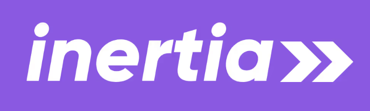
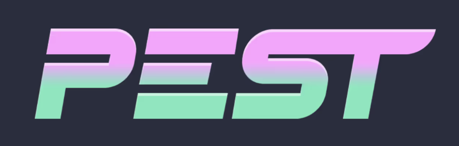

# 👋 Welcome to my casa of code

I'm **Hakim Zahiri**, also known as **Mikahza** 🚀  
A curious mind passionate about **coding, technology, and building systems**.  
This is my place to learn, create, and share — _my casa of code_ 🏡💻

## ✨ About Me

- 🧑‍💻 Software developer currently working at 
- 🌍 Interested in **cloud, architecture, and scalable systems**.
- 🎯 Goal: grow into a **Solutions Architect** and design systems that matter.
- 🏡 Fun fact: _“Mikahza” is Hakim reversed + Zahiri... and also sounds like **mi casa**._

## 🔧 Tech Stack & Tools

#### 🧩 Languages

#### ⚙️ Backend

#### 🎨 Frontend & Mobile

#### 🗄️ Databases

#### ☁️ DevOps & Cloud

#### 🔗 APIs & Collaboration

#### ✅ Quality

#### 🤖 AI & Dev Tools

## 🐍 Contribution Snake

<picture>
  <source media="(prefers-color-scheme: dark)" srcset="https://raw.githubusercontent.com/Mikahza/Mikahza/output/github-snake-dark.svg" />
  <source media="(prefers-color-scheme: light)" srcset="https://raw.githubusercontent.com/Mikahza/Mikahza/output/github-snake.svg" />
  
</picture>
